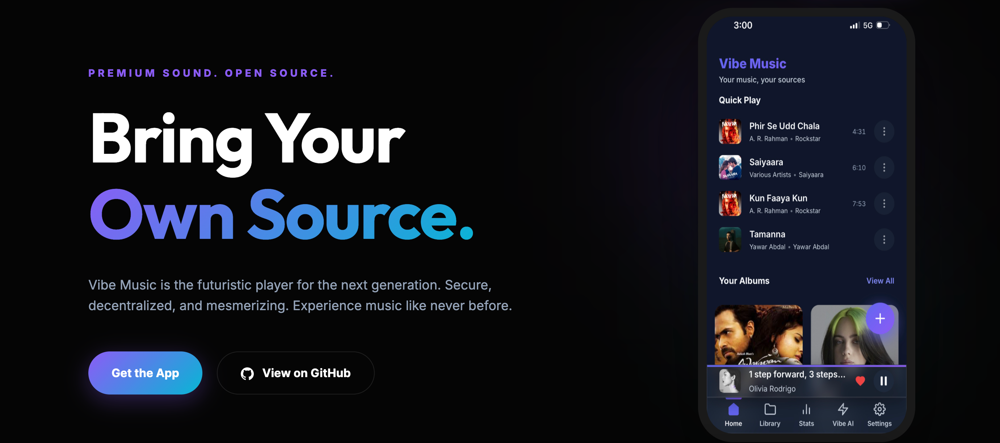

<div align="center">

# 🎵 Vibe Music
#### Open-source cloud music player with bring-your-own music, local control, sync, and no platform lock-in.

[](https://web.vibemusic.fm)
[](https://react.dev)
[](https://web.vibemusic.fm)

<br />


*Experience the vibe at **[web.vibemusic.fm](https://web.vibemusic.fm)***

<br />

</div>

## ✨ The Vision
Vibe Music isn't just another player; it's a statement against the locked-down streaming era. Built on the open-source spirit, it leverages the massive library of **Archive.org** to deliver millions of tracks through a premium, glassmorphic interface that feels like the future of the web.

No trackers, no algorithms you didn't ask for—just you, your music, and a high-performance local engine.

## 🚀 Core Pillars

### 🧠 Vibe AI: Your Context-Aware Assistant
Unlike generic bots, **Vibe AI** is deeply integrated with your library. It knows your top artists, your niche album discoveries, and your listening patterns. 
- Powered by OpenAI or Google Gemini (User-provided keys).
- Real-time streaming responses.
- Generates personalized recommendations based on *your* actual data.

### 🍱 The Interface: Hand-Crafted Glassmorphism
No generic UI frameworks here. Every pixel of the glassmorphic design system is hand-coded vanilla CSS, optimized for performance and aesthetic pleasure.
- **PWA-Native**: Install on iOS, Android, or Desktop with zero friction.
- **Media Session API**: native lock-screen controls for the nomadic listener.
- **Cache Mastery**: Advanced offline storage management with configurable TTL.

---

## 🛠️ Technical Anatomy

### Frontend Stack
- **Library**: `React 19` (Latest features for maximum reactivity)
- **State/Routing**: `React Router 7`, `Context API`
- **Offline Engine**: `IndexedDB` via `LocalForage` + `Workbox PWA`
- **Styling**: `Custom CSS Modules` (Zero-bloat architecture)

---

## ⚡ Getting Started

### 1. Clone & Frontend Setup
```bash
git clone https://github.com/vibe-music/vibe-music.git
cd vibe-music
npm install
npm run dev
```

### 2. Open the Vibe
Navigate to `http://localhost:5173` and start importing your first albums from the integrated Archive.org search.

---

## 🗺️ Roadmap: The Nomadic Journey
The web is just the beginning. We are working on bringing the full high-fidelity experience to all your devices:

- [ ] **Native Android App**: Optimized for mobile performance and background playback (Coming Soon).
- [ ] **Native iOS/iPadOS App**: A premium Apple ecosystem experience (Coming Soon).
- [ ] **Desktop Apps**: Dedicated builds for Windows, macOS, and Linux.
- [ ] **Advanced Vibe Mode**: Real-time visualizers and immersive spatial audio profiles.

---

## 🤝 Contribution: Play Your Part
Vibe Music is an open-source symphony. We value code quality, aesthetic eyes, and performance optimizations.

1. **Fork** the repository.
2. **Branch** off: `git checkout -b feat/your-epic-feature`.
3. **Commit** with style: `git commit -m "feat: implement high-fidelity visualizer"`.
4. **Push** and open a PR.

---

<div align="center">
  <p>Licensed under <b>PolyForm Noncommercial 1.0.0</b>. Made with 💜 for the music vibes.</p>
  <p>Learn more at <b>[vibemusic.fm](https://vibemusic.fm)</b></p>
  <b>Stay Vibe.</b>
</div>
